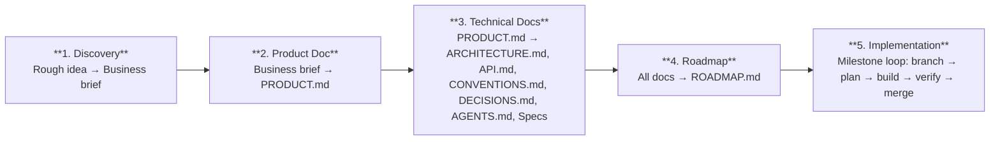

# Claude Code Project Starter Kit

A framework for going from a rough product idea to a fully documented, build-ready project that Claude Code can implement milestone by milestone.

## The Problem

Starting a new project with Claude Code is powerful, but the quality of output depends entirely on the quality of input. Without structured documentation, you end up re-explaining context every session, getting inconsistent code, and losing track of what's been decided.

This kit gives you a repeatable process for creating that documentation — from initial product idea through to a sequenced build roadmap.

> **Note:** This kit is designed for non-trivial projects — apps with multiple features, data models, and real architecture decisions. If you're building a weekend hack or a small utility, you probably don't need this level of scaffolding. Just start coding.

## The Pipeline



## Files

| File | What It Does | Where to Run | When to Use It |
|---|---|---|---|
| [`01-product-discovery.md`](01-product-discovery.md) | Structured product discovery process. Give it to Claude with a rough idea — it acts as a PM, researches competitors, asks questions across 9 discovery areas, and produces a business brief. | Claude.ai (web search) or Claude Code | Start of a new project, before any technical work |
| [`02-create-product-doc.md`](02-create-product-doc.md) | Guide for creating PRODUCT.md — the product requirements document that defines what gets built and why. | Claude Code (needs file system) | After the business brief is done |
| [`03-create-technical-docs.md`](03-create-technical-docs.md) | Guide for creating ARCHITECTURE.md, API.md, CONVENTIONS.md, DECISIONS.md, breakout specs, AGENTS.md, and CLAUDE.md. | Claude Code (needs file system) | After PRODUCT.md is done, before generating roadmap |
| [`04-generate-roadmap.md`](04-generate-roadmap.md) | Process for turning project docs into a dependency-sequenced build roadmap with milestones. Give this file to Claude Code along with access to your docs folder. | Claude Code (needs file system) | After all docs are written, before starting implementation |
| [`05-implement-milestones.md`](05-implement-milestones.md) | Practical workflow for building each milestone — git branching, Claude Code prompting patterns, verification, and merge process. | Claude Code (needs terminal + file system) | During implementation, every milestone |

## Quick Start

### Step 1: Product Discovery

Give [`01-product-discovery.md`](01-product-discovery.md) to Claude along with a short description of your product idea:

```
Here is my product idea:

"I want to build an app that helps freelancers track time across multiple clients
and generate invoices automatically."

Follow the product discovery process defined in this document. Work through the
discovery areas, then produce the business brief using the template provided.
```

Claude will research the market, ask structured questions, and help you produce a `business-brief.md`.

### Step 2: Create PRODUCT.md

Give [`02-create-product-doc.md`](02-create-product-doc.md) to Claude Code along with your completed business brief:

```
Here is my completed business brief:

{PASTE YOUR BUSINESS BRIEF HERE}

Follow the process defined in this document to create docs/PRODUCT.md. Work
through each section, getting my feedback before moving to the next. Ask me
questions whenever the brief is ambiguous rather than guessing at requirements.
```

Claude Code will create a comprehensive PRODUCT.md with features, user flows, data models, and acceptance criteria. **Commit and start a fresh session for step 3.**

### Step 3: Create Technical Documentation

Give [`03-create-technical-docs.md`](03-create-technical-docs.md) to Claude Code in a **new session**:

```
Read docs/PRODUCT.md and docs/1 - Discovery/business-brief.md. Then follow the
process in this document to create the technical documentation — one document at
a time, getting my feedback before moving to the next.
```

Claude Code will create ARCHITECTURE.md, API.md, CONVENTIONS.md, DECISIONS.md, breakout specs, AGENTS.md, and CLAUDE.md.

### Step 4: Generate the Roadmap

Give [`04-generate-roadmap.md`](04-generate-roadmap.md) to Claude Code in a **new session**:

```
Read all files in the docs/ folder and create docs/ROADMAP.md — a build-order
roadmap for Phase 1. Follow the generation process and output format defined
in this document exactly.
```

Claude Code reads all your docs and produces `ROADMAP.md` — a sequenced list of milestones with dependencies, doc references, and "done when" criteria.

### Step 5: Build

For each milestone, follow the loop from [`05-implement-milestones.md`](05-implement-milestones.md):

```bash
# Branch
git checkout -b milestone/m2-auth-profiles
```

Start Claude Code in plan mode:

```
We're starting milestone M2 — Auth & User Profiles.

Read these docs before planning:
- docs/ARCHITECTURE.md — Auth section
- docs/API.md — Auth endpoints
- docs/PRODUCT.md — Section 2.1 (User accounts)

Then plan the implementation.
```

Review the plan, approve, build, verify against "done when" criteria, merge, and update ROADMAP.md. Repeat for every milestone until you ship.

## Output Structure

After completing steps 1-4, your repo will look like:

```
project-root/
├── AGENTS.md                    # Agent instructions (source of truth)
├── CLAUDE.md                    # "See @AGENTS.md"
├── docs/
│   ├── PRODUCT.md               # Product requirements
│   ├── ARCHITECTURE.md          # System design
│   ├── API.md                   # Endpoint contracts
│   ├── CONVENTIONS.md           # Code style rules
│   ├── DECISIONS.md             # Architecture Decision Records
│   ├── ROADMAP.md               # Build-order milestones
│   ├── 1 - Discovery/
│   │   └── business-brief.md    # From Step 1
│   └── 2 - Specs/
│       ├── database-schema.md
│       └── ...
```

## Multi-Agent Support

The docs structure uses AGENTS.md as the single source of truth for all AI coding tools. Tool-specific config files just point to it:

| Tool | Config File | Contents |
|---|---|---|
| Claude Code | `CLAUDE.md` | `See @AGENTS.md` |
| Cursor | `.cursorrules` | `See @AGENTS.md` |
| Codex | `codex.md` | `See @AGENTS.md` |
| Others | Their config file | `See @AGENTS.md` |

One place to update, every tool stays in sync.

## Right-Sizing for Your Project

Not every project needs every document. Here's a rough guide:

| Project Complexity | Docs to Create |
|---|---|
| **Minimum viable** (solo dev, single feature domain) | PRODUCT.md, ARCHITECTURE.md, CONVENTIONS.md, AGENTS.md |
| **Standard** (multi-feature app, API-driven) | All of the above + API.md, DECISIONS.md, ROADMAP.md |
| **Full set** (complex system, multiple services, team) | All of the above + breakout specs in `2 - Specs/` |

When in doubt, start with the standard set. You can always add breakout specs later when a section of ARCHITECTURE.md or PRODUCT.md gets too detailed.

## Extending This

The five files here cover the core workflow from idea to implementation. As your workflow matures, explore Claude Code's advanced features — Skills (custom slash commands), MCP Servers (external service connections), Hooks (lifecycle automation), and Subagents (parallel task delegation). See the [Claude Code documentation](https://docs.anthropic.com/en/docs/claude-code) for details.

## License

MIT — use however you want.
