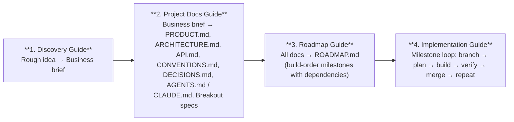

# Claude Code Project Starter Kit

A framework for going from a rough product idea to a fully documented, build-ready project that Claude Code can implement milestone by milestone.

## The Problem

Starting a new project with Claude Code is powerful, but the quality of output depends entirely on the quality of input. Without structured documentation, you end up re-explaining context every session, getting inconsistent code, and losing track of what's been decided.

This kit gives you a repeatable process for creating that documentation — from initial product idea through to a sequenced build roadmap.

> **Note:** This kit is designed for non-trivial projects — apps with multiple features, data models, and real architecture decisions. If you're building a weekend hack or a small utility, you probably don't need this level of scaffolding. Just start coding.

## The Pipeline



## Files

| File | What It Does | When to Use It |
|---|---|---|
| [`01-product-discovery.md`](01-product-discovery.md) | Structured product discovery process. Give it to Claude with a rough idea — it acts as a PM, researches competitors, asks questions across 8 discovery areas, and produces a business brief. | Start of a new project, before any technical work |
| [`02-create-project-docs.md`](02-create-project-docs.md) | Complete reference for setting up project documentation. Defines every file in the `/docs` folder, what it contains, and a step-by-step setup sequence. | After the business brief is done, before writing code |
| [`03-generate-roadmap.md`](03-generate-roadmap.md) | Process for turning project docs into a dependency-sequenced build roadmap with milestones. Includes the prompt template for Claude Code. | After all docs are written, before starting implementation |
| [`04-implement-milestones.md`](04-implement-milestones.md) | Practical workflow for building each milestone — git branching, Claude Code prompting patterns, verification, and merge process. | During implementation, every milestone |

## Quick Start

### Step 1: Product Discovery

Open a conversation with Claude. Paste the contents of `01-product-discovery.md` along with a short description of your product idea:

> "I want to build an app that helps freelancers track time across multiple clients and generate invoices automatically."

Claude will research the market, ask structured questions, and help you produce a `business-brief.md`.

### Step 2: Create Project Documentation

Give Claude the `02-create-project-docs.md` file and your completed business brief. Work through creating each document in order:

1. PRODUCT.md — product requirements
2. ARCHITECTURE.md — system design
3. API.md — endpoint contracts
4. CONVENTIONS.md — code style rules
5. DECISIONS.md — architecture decision records
6. Breakout specs in `2 - Specs/` — detailed specs for complex topics
7. AGENTS.md — agent instructions (single source of truth)
8. CLAUDE.md — pointer to AGENTS.md

### Step 3: Generate the Roadmap

Give Claude Code the prompt from `03-generate-roadmap.md` (or use the template at the bottom of the file). It reads all your docs and produces `ROADMAP.md` — a sequenced list of milestones with dependencies, doc references, and "done when" criteria.

### Step 4: Build

For each milestone, follow the loop from `04-implement-milestones.md`:

```bash
# Branch
git checkout -b milestone/m4-entity-crud
```

Start Claude Code in plan mode:

```
We're starting milestone M4 — Entity CRUD + RLS.

Read these docs before planning:
- docs/API.md — Entities section
- docs/2 - Specs/database-schema.md — entities table, RLS policies
- docs/PRODUCT.md — Section 3.2 (Entity model)

Then plan the implementation.
```

Review the plan, approve, build, verify against "done when" criteria, merge, and update ROADMAP.md. Repeat for every milestone until you ship.

## Output Structure

After completing steps 1-3, your repo will look like:

```
project-root/
├── AGENTS.md                    # Agent instructions (source of truth)
├── CLAUDE.md                    # "See @AGENTS.md"
├── docs/
│   ├── PRODUCT.md               # Product requirements
│   ├── ARCHITECTURE.md          # System design
│   ├── API.md                   # Endpoint contracts
│   ├── CONVENTIONS.md           # Code style rules
│   ├── DECISIONS.md             # Architecture Decision Records
│   ├── ROADMAP.md               # Build-order milestones
│   ├── 1 - Discovery/
│   │   └── business-brief.md    # From Step 1
│   └── 2 - Specs/
│       ├── database-schema.md
│       └── ...
```

## Multi-Agent Support

The docs structure uses AGENTS.md as the single source of truth for all AI coding tools. Tool-specific config files just point to it:

| Tool | Config File | Contents |
|---|---|---|
| Claude Code | `CLAUDE.md` | `See @AGENTS.md` |
| Cursor | `.cursorrules` | `See @AGENTS.md` |
| Codex | `codex.md` | `See @AGENTS.md` |
| Others | Their config file | `See @AGENTS.md` |

One place to update, every tool stays in sync.

## Extending This

This repo gets you started with a solid foundation. As your workflow matures, you can layer on additional tools to accelerate the process:

- **Claude Code Skills** — custom reusable workflows you can invoke with slash commands (e.g., `/deploy`, `/test-rls`, `/generate-migration`)
- **MCP Servers** — connect Claude Code to external services like databases, Slack, Google Drive, or custom APIs
- **Hooks** — automate actions at lifecycle events (run linters after edits, format code before commits, notify on task completion)
- **Subagents** — delegate specialized work to parallel agents (one handles frontend, another handles backend)
- **Custom Agents** — build your own agents with specific personalities, tool access, and workflows tailored to your team's process

The four files here cover the core workflow from idea to implementation. Everything above is optional enhancement on top of that.

## License

MIT — use however you want.
